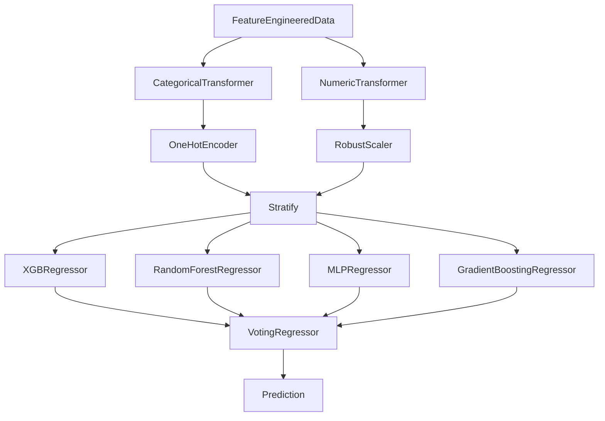

# **Part 5**

In Part 5, I finally [Ensemble](https://scikit-learn.org/stable/modules/ensemble.html) the top four preforming models together using a [VotingRegressor](https://scikit-learn.org/stable/modules/generated/sklearn.ensemble.VotingRegressor.html#sklearn.ensemble.VotingRegressor) to minimize [Bias](https://towardsdatascience.com/a-quickstart-guide-to-uprooting-model-bias-f4465c8e84bc) and [Variance](https://x.com/akshay_pachaar/status/1703757251474063861?s=20). This iterative process maximized predictive accuracy and ultimately delivered valuable insights leading to a MAE under 10 feet.

<table>
<tbody>
  <tr>
    <td>
      
    </td>
</tr>
</tbody>
</table>

## **[Use Cases](https://nbviewer.org/github/dec1costello/Baseball/blob/main/Distance-Predictor/Distance-Predictor-Part-UseCase.ipynb)**

I finally put the [ensemble model](https://scikit-learn.org/stable/modules/ensemble.html) to good use by exploring Optimal PFX for Distance, Optimal Launch Angles by Exit Veloicity for Distance, and Stadium Distance Variation.

<table>
<tbody>
  <tr>
    <td>
      
    </td>
</tr>
</tbody>
</table>

# TODO -  [Metrics](https://docs.seldon.io/projects/alibi/en/stable/overview/high_level.html) & Redo DFs
- Throw in [SageMaker](https://sagemaker-examples.readthedocs.io/en/latest/sagemaker-python-sdk/scikit_learn_randomforest/Sklearn_on_SageMaker_end2end.html)
- Add top 8 Models to Ensemble
- [Sample Table](https://karbartolome.quarto.pub/the-grammar-of-tables/)
- [Plottable](https://github.com/znstrider/plottable)
- [Plottable Docs](https://plottable.readthedocs.io/en/latest/)
- [Add CatBoostRegressor()](https://towardsdatascience.com/catboost-regression-in-6-minutes-3487f3e5b329)
- [Huber loss](https://medium.com/analytics-vidhya/a-comprehensive-guide-to-loss-functions-part-1-regression-ff8b847675d6)
- Quantile loss
- crate a [Rapids](https://rapids.ai/) ipynb to run model faster
- [Add more partial dependence plots](https://scikit-learn.org/stable/auto_examples/miscellaneous/plot_partial_dependence_visualization_api.html#sphx-glr-auto-examples-miscellaneous-plot-partial-dependence-visualization-api-py)
- Compare to https://www.omnicalculator.com/physics/projectile-motion
- Fix all vars to mean and plot ev on x axis, launch angle on y axis, and color for distance

