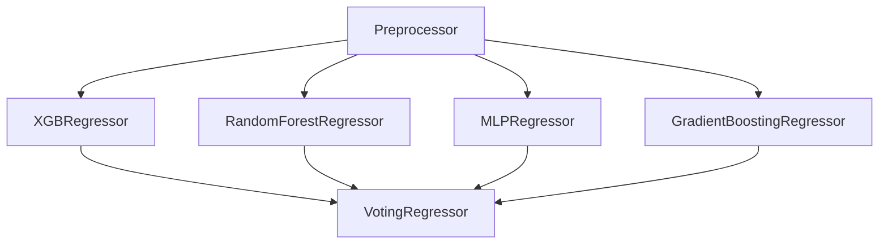

# **Distance Predictor**
*Author: Declan Costello*

## **[Try Live Light Weight Model Here!](https://light-weight-distance-predictor.streamlit.app/)**

## **Project Overview**

Welcome to the **Distance Predictor**. Inspired by [NASA's Distance Predictor](https://www1.grc.nasa.gov/beginners-guide-to-aeronautics/whit/#play-ball), this project harnesses data from [Pybaseball Data](https://github.com/jldbc/pybaseball), specifically from the 2022 MLB Season, to forecast the trajectory of batted ball distances. With an interest in hitting mechanics and atmospheric influences, the primary aspiration is to contribute meaningful insights to the baseball community. To get a better feel for the visual details, I encourage you to check out the interactive visuals created using [Bokeh](http://bokeh.org/) for [Parts 3-5 on NBViewer](https://nbviewer.org/github/dec1costello/Baseball/blob/main/Distance-Predictor/). Also, as [Tyler James Burch](https://github.com/tjburch) pointed out, because [Triples are hard to distinguish](http://tylerjamesburch.com/blog/baseball/hit-classifier-1), I combined Triples and Home Runs in my Event visuals.

## **Data Source**

Provided here is a hyperlink to access the processed [CSV dataset](https://drive.google.com/file/d/1tnhLBWTBbbo917c8f9LYwdVHwd-gr5bU/view?usp=sharing) needed for parts 3 through 5. This hyperlink is a much quicker alternative compared to waiting an hour for [Pybaseball's](https://github.com/jldbc/pybaseball) download and it only includes the most important information needed.

## **Table of Contents**

1. [Part 1, Data Exploration](https://nbviewer.org/github/dec1costello/Baseball/blob/main/Distance-Predictor/Distance-Predictor-Part-1.ipynb)
2. [Part 2, Feature Engineering](https://nbviewer.org/github/dec1costello/Baseball/blob/main/Distance-Predictor/Distance-Predictor-Part-2.ipynb)
3. [Part 3, Model Selection: XGBoost](https://nbviewer.org/github/dec1costello/Baseball/blob/main/Distance-Predictor/Distance-Predictor-Part-3.ipynb)
4. [Part 4, XGBoost Parameter Optimization and Insights](https://nbviewer.org/github/dec1costello/Baseball/blob/main/Distance-Predictor/Distance-Predictor-Part-4.ipynb)
5. [Part 5, Pipeline Synthesis and Results Showcase](https://nbviewer.org/github/dec1costello/Baseball/blob/main/Distance-Predictor/Distance-Predictor-Part-5.ipynb)

## **Part 1 & 2, [Data Exploration](https://nbviewer.org/github/dec1costello/Baseball/blob/main/Distance-Predictor/Distance-Predictor-Part-1.ipynb) and [Feature Engineering](https://nbviewer.org/github/dec1costello/Baseball/blob/main/Distance-Predictor/Distance-Predictor-Part-2.ipynb)**

In Parts 1 & 2, I explore the data and start to feature engineer to help understand, clean, and refine the dataset. It guides model choice and assumption validation, while also revealing insights through visualization. By addressing data quality and understanding patterns early, here I establish a strong foundation for the rest of my project.

<table>

<tbody>
  <tr>
    <td>
      
    </td>
    <td>
      
    </td>
</tr>
</tbody>
</table>

## **Part 3, [Model Selection](https://nbviewer.org/github/dec1costello/Baseball/blob/main/Distance-Predictor/Distance-Predictor-Part-3.ipynb)**

In Part 3, I use grid search to select the best ML model, as it entails choosing the most suitable algorithm for a given task. It ensures optimal use of resources by aligning the algorithm's assumptions with the data characteristics. This leads to better predictive accuracy, efficient training, and successful problem-solving.

<table>

<tbody>
  <tr>
    <td>
      
    </td>
</tr>
</tbody>
</table>

## **Parts 4 & 5, [Optimization](https://nbviewer.org/github/dec1costello/Baseball/blob/main/Distance-Predictor/Distance-Predictor-Part-4.ipynb) and [Results](https://nbviewer.org/github/dec1costello/Baseball/blob/main/Distance-Predictor/Distance-Predictor-Part-5.ipynb)**

In Parts 4 & 5, I hyper parameter tuned with [Grid Search](https://scikit-learn.org/stable/modules/generated/sklearn.model_selection.GridSearchCV.html#sklearn.model_selection.GridSearchCV), [Randomized Search](https://scikit-learn.org/stable/modules/generated/sklearn.model_selection.RandomizedSearchCV.html), and [Halving Grid Search](https://scikit-learn.org/stable/modules/generated/sklearn.model_selection.HalvingGridSearchCV.html) to achieve peak performance. I finally [Ensemble](https://scikit-learn.org/stable/modules/ensemble.html) all the models together using a [VotingRegressor](https://scikit-learn.org/stable/modules/generated/sklearn.ensemble.VotingRegressor.html#sklearn.ensemble.VotingRegressor). This iterative process maximized predictive accuracy and ultimately delivered valuable insights showing that XGBoost was the best model leading to a MAE of under 10 feet.

```mermaid
graph LR
    subgraph 1[Distance Predictor]
        subgraph 2[Preprocessor]
            Preprocessor(pre) --> CategoricalTransformer;
            Preprocessor(pre) --> NumericTransformer;
            CategoricalTransformer --> OneHotEncoder;
            OneHotEncoder --> preprocessed;
            NumericTransformer --> RobustScaler;
            RobustScaler --> preprocessed;
        end
        preprocessed-->XGBRegressor;
        preprocessed-->RandomForestRegressor;
        preprocessed-->MLPRegressor;
        preprocessed-->GradientBoostingRegressor;
        XGBRegressor-->VotingRegressor;
        RandomForestRegressor-->VotingRegressor;
        MLPRegressor-->VotingRegressor;
        GradientBoostingRegressor-->VotingRegressor;
    end
style 1 fill:#333333,stroke:#FFFFFF,stroke-width:2px
style 2 fill:#222222,stroke:#FFFFFF,stroke-width:1px
```

<table>
  <tr>
    <td> </td>
    <td> </td>
  </tr>
  <tr> <a>
    <td colspan="2"> </td>
  </a>
  </tr>
</table>

## **TODO**

- Impute missing values
- Add temp and humidity features, possibly wind...
- Investigate [Bias](https://towardsdatascience.com/a-quickstart-guide-to-uprooting-model-bias-f4465c8e84bc) vs [ Variance](https://x.com/akshay_pachaar/status/1703757251474063861?s=20)
- [Mermaid ensemble chart](https://towardsdatascience.com/ensemble-learning-using-scikit-learn-85c4531ff86a) 
- Incorporate [BayesSearchCV](https://scikit-optimize.github.io/stable/modules/generated/skopt.BayesSearchCV.html)
