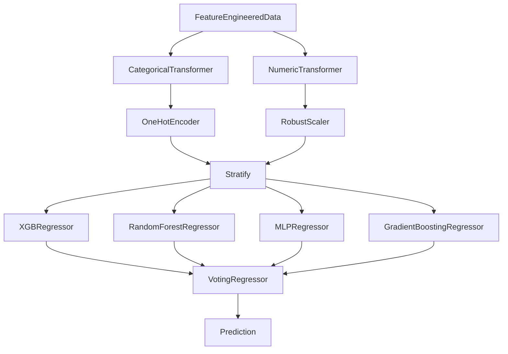

# **Distance Predictor**
*Author: Declan Costello*

## **[📌 Try Live Model Here!](https://light-weight-distance-predictor.streamlit.app/)**

**Update (Oct 2023)**: I am stoked to announce that Streamlit has hand selected **The Distance Predictor** to be featured in their [gallery of awesome projects!](https://streamlit.io/gallery?category=sports-fun)

## **Project Overview**

Welcome to the **Distance Predictor**. Inspired by [NASA's Distance Predictor](https://www1.grc.nasa.gov/beginners-guide-to-aeronautics/whit/#play-ball), this project harnesses data from [Pybaseball Data](https://github.com/jldbc/pybaseball), specifically from the 2022 MLB Season, to forecast the trajectory of batted ball distances. With an interest in hitting mechanics and atmospheric influences, the primary aspiration is to contribute meaningful insights to the baseball community. To get a better feel for the visual details, I encourage you to check out the interactive visuals created using [Bokeh](http://bokeh.org/) for [Parts 3-5 on NBViewer](https://nbviewer.org/github/dec1costello/Baseball/blob/main/Distance-Predictor/). Also, as [Tyler James Burch](https://github.com/tjburch) pointed out, because [Triples are hard to distinguish](http://tylerjamesburch.com/blog/baseball/hit-classifier-1), I combined Triples and Home Runs in my Event visuals.

## **Data Source**

Provided here is a hyperlink to access the processed [CSV dataset](https://drive.google.com/file/d/1tnhLBWTBbbo917c8f9LYwdVHwd-gr5bU/view?usp=sharing) needed for parts 3 through 5. This hyperlink is a much quicker alternative compared to waiting an hour for [Pybaseball's](https://github.com/jldbc/pybaseball) download and it only includes the most important information needed.

## **Table of Contents**

1. [Part 1, Data Exploration](https://nbviewer.org/github/dec1costello/Baseball/blob/main/Distance-Predictor/Distance-Predictor-Part-1.ipynb)
2. [Part 2, Feature Engineering](https://nbviewer.org/github/dec1costello/Baseball/blob/main/Distance-Predictor/Distance-Predictor-Part-2.ipynb)
3. [Part 3, Model Selection: XGBoost](https://nbviewer.org/github/dec1costello/Baseball/blob/main/Distance-Predictor/Distance-Predictor-Part-3.ipynb)
4. [Part 4, XGBoost Parameter Optimization and Insights](https://nbviewer.org/github/dec1costello/Baseball/blob/main/Distance-Predictor/Distance-Predictor-Part-4.ipynb)
5. [Part 5, Pipeline Synthesis and Results Showcase](https://nbviewer.org/github/dec1costello/Baseball/blob/main/Distance-Predictor/Distance-Predictor-Part-5.ipynb)

## **Part 1 & 2, [Data Exploration](https://nbviewer.org/github/dec1costello/Baseball/blob/main/Distance-Predictor/Distance-Predictor-Part-1.ipynb) and [Feature Engineering](https://nbviewer.org/github/dec1costello/Baseball/blob/main/Distance-Predictor/Distance-Predictor-Part-2.ipynb)**

In Parts 1 & 2, I explore the data and start to feature engineer to help understand, clean, and refine the dataset. It guides model choice and assumption validation, while also revealing insights through visualization. By addressing data quality and understanding patterns early, here I establish a strong foundation for the rest of my project.

<table>

<tbody>
  <tr>
    <td>
      
    </td>
    <td>
      
    </td>
</tr>
</tbody>
</table>

## **Part 3, [Model Selection](https://nbviewer.org/github/dec1costello/Baseball/blob/main/Distance-Predictor/Distance-Predictor-Part-3.ipynb)**

In Part 3, I use grid search to select the best ML model, as it entails choosing the most suitable algorithm for a given task. It ensures optimal use of resources by aligning the algorithm's assumptions with the data characteristics. This leads to better predictive accuracy, efficient training, and successful problem-solving.

<table>

<tbody>
  <tr>
    <td>
      
    </td>
</tr>
</tbody>
</table>

## **Part 4, [Optimization](https://nbviewer.org/github/dec1costello/Baseball/blob/main/Distance-Predictor/Distance-Predictor-Part-4.ipynb)**

In Part 4, I hyper parameter tuned each model with [GridSearch](https://scikit-learn.org/stable/modules/generated/sklearn.model_selection.GridSearchCV.html#sklearn.model_selection.GridSearchCV), [RandomizedSearch](https://scikit-learn.org/stable/modules/generated/sklearn.model_selection.RandomizedSearchCV.html), [BayesSearchCV](https://scikit-optimize.github.io/stable/modules/generated/skopt.BayesSearchCV.html), and [HalvingGrid Search](https://scikit-learn.org/stable/modules/generated/sklearn.model_selection.HalvingGridSearchCV.html) to achieve peak performance. I finally get the magnitude of feature attributions with [SHap's game theoretic approach](https://shap.readthedocs.io/en/latest/) to identified bias and trends for each model.

<table>

<tbody>
  <tr>
    <td>
      
    </td>
    <td>
      
    </td>
  </tr>
  <tr>
    <th colspan="2"> 
      
    </th>
  </tr>
  <tr>

   
</tbody>
</table>

## **Part 5, [Results](https://nbviewer.org/github/dec1costello/Baseball/blob/main/Distance-Predictor/Distance-Predictor-Part-5.ipynb)**

In Part 5, I finally [Ensemble](https://scikit-learn.org/stable/modules/ensemble.html) all the models together using a [VotingRegressor](https://scikit-learn.org/stable/modules/generated/sklearn.ensemble.VotingRegressor.html#sklearn.ensemble.VotingRegressor) to minimize [Bias](https://towardsdatascience.com/a-quickstart-guide-to-uprooting-model-bias-f4465c8e84bc) and [Variance](https://x.com/akshay_pachaar/status/1703757251474063861?s=20). This iterative process maximized predictive accuracy and ultimately delivered valuable insights leading to a MAE under 10 feet.

<table>
<tbody>
  <tr>
    <td>
      
    </td>
</tr>
</tbody>
</table>

## **TODO**

Feature Engineering:
- Impute missing values
- Add [My Custom Park Factors](https://github.com/dec1costello/Baseball/tree/main/Stadiums)
- [Temp and Humidity](https://towardsdatascience.com/getting-weather-data-in-3-easy-steps-8dc10cc5c859)
- Wind
- Hang time
- Player max la arch
- At bats with contact per person
- HR per player per at bat contact
- Barrel per he per person at bat contact
- Day / Night Game
- Starting pitcher ERA
- [Redo barrel cassifications](https://x.com/JonPgh/status/1706726176973373637?s=20)

[Metrics](https://docs.seldon.io/projects/alibi/en/stable/overview/high_level.html):
- [Huber loss](https://medium.com/analytics-vidhya/a-comprehensive-guide-to-loss-functions-part-1-regression-ff8b847675d6)
- Quantile loss
- Try to use LIME to measure the magnitude of feature attributions of the finla ensemble because its a model agnostic opposed to SHAP
  -  explainer = lime.LimeRegressor(er)
  -  explanation = explainer.explain_instance(X_test[0], voting_regressor.predict)

Auto EDA:
- [IPyWidgets](https://towardsdatascience.com/interactive-controls-for-jupyter-notebooks-f5c94829aee6)
- [Ydata-profiling](https://github.com/ydataai)
- [Dtale](https://github.com/man-group/dtale)
- [Sweetviz](https://towardsdatascience.com/sweetviz-automated-eda-in-python-a97e4cabacde)
- [Autoviz](https://towardsdatascience.com/autoviz-automatically-visualize-any-dataset-75876a4eede4)
